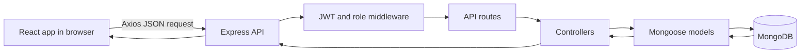

# IIPS LabTrack

IIPS LabTrack is a full-stack lab management and analytics application for the Institute of Indore Professional Studies (IIPS). It provides a shared workspace for administrators and students to manage lab sessions, record attendance, track practical assignments, and review academic activity.

The current application is scoped to **MCA semester 9**, **MCA**, and the **OOAD** and **MM** subjects. The React client communicates with a JSON REST API. The API uses MongoDB for persistence and JWT bearer tokens for authenticated requests.

## Contents

- [Features](#features)
- [Technology stack](#technology-stack)
- [Application structure](#application-structure)
- [Architecture and request flow](#architecture-and-request-flow)
- [Authentication and access control](#authentication-and-access-control)
- [Database model](#database-model)
- [Requirements and setup](#requirements-and-setup)
- [Environment configuration](#environment-configuration)
- [Run the application](#run-the-application)
- [Demo data and accounts](#demo-data-and-accounts)
- [API reference](#api-reference)
- [Analytics](#analytics)
- [Operational notes](#operational-notes)
- [Limitations and possible extensions](#limitations-and-possible-extensions)

## Features

- Student and administrator sign-in using email and password.
- Student registration for the supported cohort: MCA semester 9.
- Administrator pages for students, lab sessions, attendance, practicals, and analytics.
- Student pages for their dashboard, labs, attendance, practicals, analytics, and profile.
- Attendance tracking with `present` and `absent` states.
- Practical progress tracking with `pending`, `in-progress`, and `completed` states.
- Student-specific progress and attendance views, plus administrator overview charts.
- A ready-to-use MongoDB seed dataset for local demonstrations.
- Responsive React interface with role-specific navigation.

## Technology stack

### Frontend

- **React 18** builds the user interface.
- **Vite 6** serves the frontend in development and creates production bundles.
- **React Router 7** handles client-side navigation and role-gated pages.
- **Axios** sends API requests and attaches the saved JWT to requests.
- **Tailwind CSS 3**, **PostCSS**, and **Autoprefixer** provide styling.
- **Recharts 2** renders dashboard charts.

### Backend

- **Node.js 20+** runs the server-side JavaScript using ES modules.
- **Express 4** provides the REST API and middleware pipeline.
- **Mongoose 8** defines MongoDB schemas, validation, references, and queries.
- **jsonwebtoken** creates and verifies signed access tokens.
- **bcryptjs** hashes passwords and checks login credentials.
- **cors** allows the configured frontend origin to call the API.
- **dotenv** loads configuration from `server/.env`.
- **nodemon** restarts the API during local development.

## Application structure

```text
.
├── client/
│   ├── index.html                 # Vite HTML entry point
│   ├── vite.config.js             # React plugin and Vite configuration
│   ├── tailwind.config.js         # Tailwind content paths and theme
│   └── src/
│       ├── main.jsx               # React application bootstrap
│       ├── App.jsx                # Router, role-based routes, and app shell
│       ├── index.css              # Tailwind directives and global CSS
│       ├── components/
│       │   ├── ProtectedRoute.jsx # Client-side role gate
│       │   └── UI.jsx             # Shared layout and UI components
│       ├── context/
│       │   └── AuthContext.jsx    # Current user, login, and logout state
│       ├── pages/
│       │   ├── Login.jsx          # Login screen
│       │   └── Pages.jsx          # Dashboards and feature pages
│       └── services/
│           └── api.js             # Axios client and API error helper
├── server/
│   ├── server.js                  # Express app and server startup
│   ├── .env.example               # Example backend environment variables
│   ├── config/db.js               # MongoDB connection
│   ├── controllers/
│   │   ├── authController.js      # Register, login, and current user
│   │   └── dataController.js      # Student, lab, attendance, and analytics operations
│   ├── middleware/
│   │   ├── auth.js                # JWT authentication and admin role check
│   │   └── errors.js              # Not-found and API error responses
│   ├── models/                    # Mongoose schemas and indexes
│   ├── routes/index.js             # API route definitions
│   └── seed/
│       ├── seed.js                # Destructive demo-data reset and seed
│       └── migrateDemoScope.js    # Targeted migration of older demo data
├── scripts/
│   ├── dev.js                     # Starts client and API together
│   └── seed.js                    # Runs the server seed script from the root
├── package.json                   # Root development and seed commands
└── README.md
```

`node_modules/` folders and `client/dist/` are installed or generated files; they are not application source. The root, client, and server each have their own `package.json` and lockfile.

## Architecture and request flow



1. `client/src/main.jsx` mounts the React app. `App.jsx` creates the router, authentication provider, and role-specific routes.
2. `AuthContext` checks for a saved token on startup. If one exists, it requests `/api/auth/me` to reload the user profile.
3. Page components call the shared Axios client in `client/src/services/api.js`. Its request interceptor reads the token from `localStorage` and sends `Authorization: Bearer <token>`.
4. Express parses JSON, applies CORS, and dispatches `/api` requests to `server/routes/index.js`.
5. Protected routes run `protect` to verify the JWT and load the corresponding user. Admin-only routes also run `adminOnly`.
6. Controllers validate inputs and cohort scope, then use Mongoose models to query or update MongoDB.
7. Responses use JSON objects. Most successful data responses have `{ "success": true, "data": ... }`; authentication responses return a `user` and, on login, a `token`.

Asynchronous data-controller errors are forwarded to the shared error handler. The API returns `400` for validation or malformed IDs, `401` for missing or invalid credentials, `403` for insufficient permissions, `404` for missing resources, and `409` for duplicate records. Unexpected errors return a generic `500` response.

## Authentication and access control

### Login

`POST /api/auth/login` receives an email and password. The backend looks up the normalized email, explicitly selects the stored password hash, compares the submitted password with bcrypt, and returns a signed JWT and a safe user object. The token expires after **7 days**. The password hash is never included in the returned user object.

The frontend stores the token in browser `localStorage`. Axios adds it to protected requests. On logout, the client removes the token and clears the in-memory user. There is no server-side token revocation list; a token remains usable until it expires unless its user is deleted or the signing secret changes.

### Registration

`POST /api/auth/register` is public. It requires `name`, `email`, `password`, `studentId`, `semester`, and `branch`. Registration accepts only semester `9` and branch `MCA`; new accounts are assigned the `student` role. Passwords are hashed with bcrypt before they are saved. Email and student ID must be unique.

### Authorization rules

- `protect` requires a valid bearer token and attaches the database user to the request.
- `adminOnly` allows only users whose role is `admin`.
- Student-list and student-management routes are administrator-only.
- Students may request their own student record, attendance, progress, and analytics. Attempts to use another student's ID are rejected.
- Administrators manage students, labs, attendance, and practicals, and can view the cohort overview.
- Lab and practical operations are constrained to the configured MCA semester 9 OOAD/MM scope.
- Student progress updates are limited to that student's own account and to practicals in the same cohort.
- Client route guards improve navigation, but API middleware and controller checks enforce the actual access rules.

## Database model

MongoDB stores five Mongoose collections. ObjectId references connect attendance and progress records to their related users, labs, and practicals.

| Model | Purpose and key fields | Relationships and rules |
| --- | --- | --- |
| `User` | `name`, `email`, `password`, `role`, `studentId`, `semester`, `branch` | `email` is unique and normalized to lowercase. `password` is excluded from queries by default. `studentId` is sparse and unique; student users must have one. Roles are `student` or `admin`. |
| `Lab` | `labName`, `subject`, `semester`, `branch`, `faculty`, `date`, `startTime`, `endTime`, `room` | Subject is `OOAD` or `MM`; semester is `9`; branch is `MCA`. |
| `Attendance` | `student`, `lab`, `status`, `date` | References `User` and `Lab`; status is `present` or `absent`. A unique compound index permits one record per student per lab. |
| `Practical` | `title`, `description`, `subject`, `semester`, `branch`, `deadline`, `createdBy` | References the administrator who created it. Subject, semester, and branch use the supported cohort values. |
| `Progress` | `student`, `practical`, `status`, `submissionDate` | References `User` and `Practical`; status is `pending`, `in-progress`, or `completed`. A unique compound index permits one progress record per student per practical. |

All schemas enable creation timestamps and disable update timestamps. Deleting a student also removes their attendance and progress records. Deleting a lab removes its attendance records; deleting a practical removes its progress records.

## Requirements and setup

- Node.js **20 or newer** and npm.
- MongoDB Community Server running locally, or an accessible MongoDB connection string.
- PowerShell instructions below assume the terminal is already in the repository root.

Install the backend and frontend dependencies:

```powershell
Set-Location .\server
npm install
Set-Location ..\client
npm install
Set-Location ..
```

Create `server/.env` from the example file:

```powershell
Copy-Item .\server\.env.example .\server\.env
```

Edit `server/.env` and set a private `JWT_SECRET`. For anything beyond a local demo, use a long, randomly generated secret and do not commit `.env`.

## Environment configuration

The backend reads environment variables from `server/.env`:

| Variable | Default/example | Purpose |
| --- | --- | --- |
| `PORT` | `5000` | Port for the Express API. |
| `MONGO_URI` | `mongodb://127.0.0.1:27017/iips_labtrack` | MongoDB connection string. |
| `JWT_SECRET` | `replace_with_a_long_random_secret` | Secret used to sign and verify JWTs. Replace this value. |
| `CLIENT_URL` | `http://localhost:5173` | Single frontend origin allowed by CORS. |

The frontend uses `VITE_API_URL` if provided; otherwise it calls `http://localhost:5000/api`. For example, to use a different API host, define `VITE_API_URL` in the Vite environment with the `/api` path included.

## Run the application

Start MongoDB, then start both applications from the repository root:

```powershell
npm run dev
```

This runs `scripts/dev.js`, which starts the API with nodemon and the Vite development server. By default:

- Frontend: `http://localhost:5173`
- API: `http://localhost:5000`
- Health check: `http://localhost:5000/api/health`

To run each side separately, open two terminals in the repository root. In one terminal:

```powershell
Set-Location .\server
npm run dev
```

In the other terminal:

```powershell
Set-Location .\client
npm run dev
```

Build the frontend for production with:

```powershell
Set-Location .\client
npm run build
```

The build output is written to `client/dist/`. The repository does not currently define an Express static-file handler for serving that build; deploy the client and API using the hosting setup appropriate to your environment.

## Demo data and accounts

From the repository root, seed the database with:

```powershell
npm run seed
```

The same script can be run from the `server` folder with `npm run seed`. **Seeding is destructive:** it deletes all documents in the five application collections (`User`, `Lab`, `Attendance`, `Practical`, and `Progress`) before inserting the demo dataset. Use it only on a database that may be reset.

The seed creates one administrator, four student accounts, three lab sessions, three practicals, attendance records for every seeded student/lab pair, and one progress record for every seeded student/practical pair.

| Role | Email | Password |
| --- | --- | --- |
| Administrator | `admin@iips.edu` | `admin123` |
| Student 1 | `student1@iips.edu` | `student123` |
| Student 2 | `student2@iips.edu` | `student123` |
| Student 3 | `student3@iips.edu` | `student123` |
| Student 4 | `student4@iips.edu` | `student123` |

These credentials are for local demonstrations only. Change or remove them before exposing a seeded deployment.

The older-data migration can be run from `server` with:

```powershell
npm run migrate:demo-scope
```

It updates matching older demo lab/practical names and subjects and scopes the demo administrator to semester 9 MCA. It does not clear collections. Review the migration script and back up valuable data before applying it to a non-demo database.

## API reference

The API base path is `/api`. Unless marked **Public**, an endpoint requires `Authorization: Bearer <token>`. Routes marked **Admin** additionally require the `admin` role. JSON request bodies should use `Content-Type: application/json`.

| Method | Path | Access | Purpose |
| --- | --- | --- | --- |
| `GET` | `/api/health` | Public | API health message. |
| `POST` | `/api/auth/register` | Public | Register an MCA semester 9 student. |
| `POST` | `/api/auth/login` | Public | Verify credentials and return a JWT and user. |
| `GET` | `/api/auth/me` | Authenticated | Return the current user profile. |
| `GET` | `/api/students` | Admin | List supported-cohort students. |
| `GET` | `/api/students/:id` | Authenticated | View a cohort student; students may view only themselves. |
| `POST` | `/api/students` | Admin | Add a student and initialize progress for existing practicals. |
| `DELETE` | `/api/students/:id` | Admin | Remove a student and their attendance/progress records. |
| `GET` | `/api/labs` | Authenticated | List supported-cohort lab sessions. |
| `GET` | `/api/labs/:id` | Authenticated | Get one in-scope lab session. |
| `POST` | `/api/labs` | Admin | Create a lab session. |
| `PUT` | `/api/labs/:id` | Admin | Update a lab session. |
| `DELETE` | `/api/labs/:id` | Admin | Delete a lab session and its attendance. |
| `GET` | `/api/attendance/student/:studentId` | Authenticated | View a student's attendance; students may view only their own. |
| `GET` | `/api/attendance/lab/:labId` | Admin | View attendance for a lab session. |
| `POST` | `/api/attendance` | Admin | Upsert attendance records for a lab session. |
| `PUT` | `/api/attendance/:id` | Admin | Change an attendance status. |
| `GET` | `/api/practicals` | Authenticated | List supported-cohort practicals. |
| `GET` | `/api/practicals/:id` | Authenticated | Get one in-scope practical. |
| `POST` | `/api/practicals` | Admin | Create a practical and initialize student progress. |
| `PUT` | `/api/practicals/:id` | Admin | Update a practical. |
| `DELETE` | `/api/practicals/:id` | Admin | Delete a practical and its progress records. |
| `GET` | `/api/progress/student/:studentId` | Authenticated | View a student's practical progress; students may view only their own. |
| `POST` | `/api/progress` | Authenticated | Create or update progress for a student/practical pair. Students may update their own. |
| `PUT` | `/api/progress/:id` | Authenticated | Update a progress record; students may update their own record. |
| `GET` | `/api/analytics/student/:studentId` | Authenticated | View a student's analytics; students may view only their own. |
| `GET` | `/api/analytics/overview` | Admin | View cohort-wide dashboard aggregates. |

### Example requests

Register a student:

```json
{
  "name": "Asha Verma",
  "email": "asha@example.edu",
  "password": "choose-a-password",
  "studentId": "IIPS2025",
  "semester": "9",
  "branch": "MCA"
}
```

Record or replace attendance for multiple students in one lab session:

```json
{
  "lab": "LAB_MONGODB_OBJECT_ID",
  "records": [
    { "student": "STUDENT_MONGODB_OBJECT_ID_1", "status": "present" },
    { "student": "STUDENT_MONGODB_OBJECT_ID_2", "status": "absent" }
  ]
}
```

Save a student's practical status:

```json
{
  "student": "STUDENT_MONGODB_OBJECT_ID",
  "practical": "PRACTICAL_MONGODB_OBJECT_ID",
  "status": "in-progress"
}
```

Valid progress values are `pending`, `in-progress`, and `completed`. When a progress record is set to `completed`, the API sets its `submissionDate` to the current date; when moved to another status, it clears that date.

## Analytics

The student analytics endpoint returns lab-session totals, present/absent totals, attendance percentage, practical totals by status, practical completion percentage, and an overall percentage calculated as the average of attendance and practical completion percentages.

The administrator overview returns the supported cohort's student and lab totals, average attendance, practical completion, attendance counts, practical status counts, and up to five recent students and lab sessions. The frontend displays these figures in cards, tables, and Recharts visualizations.

## Operational notes

- The API starts only after its MongoDB connection succeeds. Connection failure is logged and exits the server process.
- CORS is configured for one origin using `CLIENT_URL`.
- The error middleware maps MongoDB duplicate-key errors to `409`, schema validation errors to `400`, and invalid ObjectIds to `400`.
- API error responses include a `success: false` field and a human-readable `message`.
- This is a scoped academic demo application. Review deployment security, transport encryption, secret management, backups, input validation, and production hosting before using real student records.
- Never commit `server/.env` or place production credentials in the README, source code, or client bundle.

## Limitations and possible extensions

The current scope supports a single cohort and two subjects. Potential extensions include configurable cohorts and subjects, attendance CSV export, timetable filters, low-attendance alerts, richer account management, token revocation, and automated test coverage.
